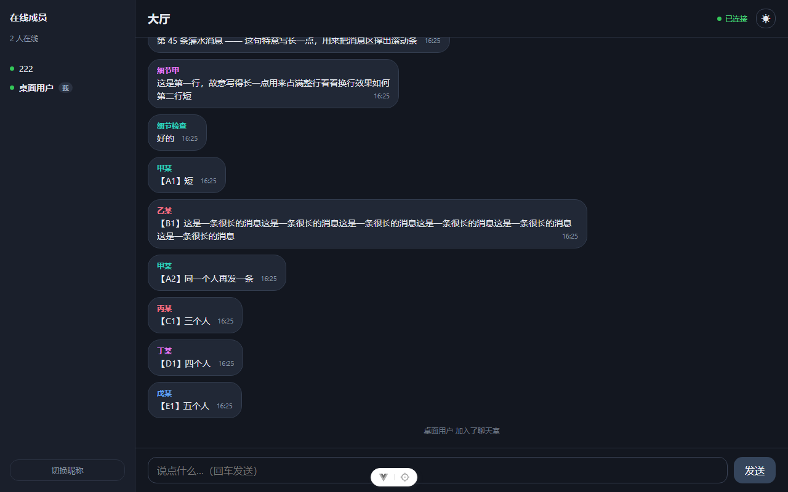
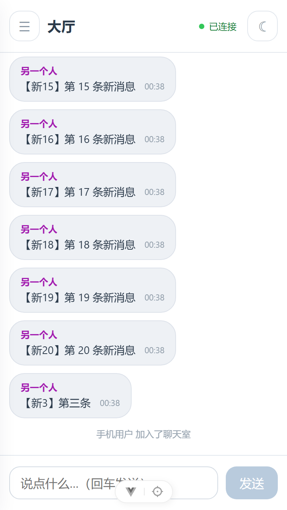
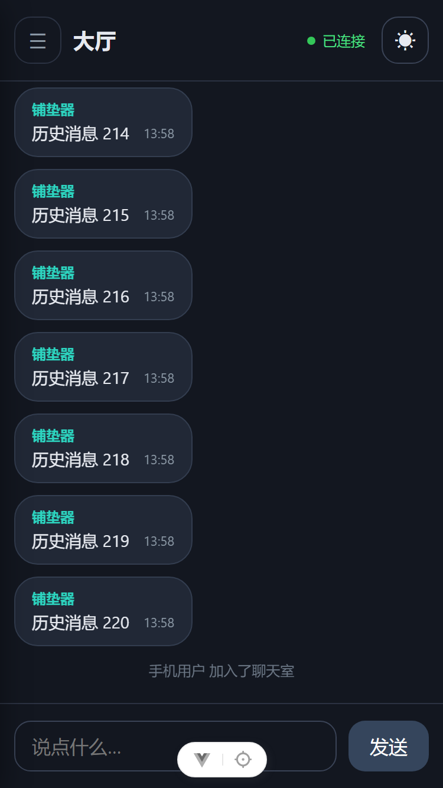

<div align="center">
<h1>轻量在线网页聊天室</h1>
</div>

## 简介
- **技术栈：** 前端：Vue 3，后端：Gin，数据库：SQLite
- **主要参考资料：** 前端：[前端三件套](https://b23.tv/pNRhYM3)、[Vue 3](https://b23.tv/pI1WAtR)，后端：[Go 语言](https://b23.tv/fq2ggce)、[HTTP 后端](https://b23.tv/ezAughK)、[Gin 框架](https://b23.tv/M9ifXAX)
- **开发工具：** VS Code + DeepSeek-V4.1-Flash
- 仓库地址 https://github.com/Cigrea/chatroom 
- 项目详细设计说明参见 [设计说明.md](./设计说明.md)

## 界面预览

| 桌面端 | 移动端 | 暗色模式 |
| --- | --- | --- |
|  |  |  |

更多截图（长对话、成员很多时、抽屉展开、320px 极窄屏等）在
[`docs/screenshots/`](docs/screenshots/) 目录下。

## 如何启动

需要先装好 **Go 1.27+** 和 **Node.js 22.18+ / 24.12+**，
各自执行 `go version`、`node -v` 能打印版本号即可。

```bash
# 终端 1：启动后端
cd server
go run .

# 终端 2：启动前端（后端要保持运行）
cd web
npm install     # 首次运行需要
npm run dev
```

浏览器打开 <http://localhost:5173>。

> **完整的运行说明见 [运行说明.md](./运行说明.md)** —— 里面有逐步的验证清单、
> 环境变量说明、以及国内网络常见问题（Go 代理、终端中文乱码、PowerShell 执行策略）的处理办法。

## 已实现功能
- 公共聊天室
- 成员加入、退出提醒
- 历史消息持久化保存（会自动清理过久的消息）
- 断线自动重连（指数退避），重连时补错过的消息
- 向上滚动自动加载更早的历史
- 正在翻历史时有新消息提醒，点按跳转
- 移动端适配（窄屏侧栏变抽屉、安全区处理）
- 切换暗色模式
- 聊天气泡宽度自适应，昵称自动分配颜色
- 重名昵称自动加序号区分

## 未实现功能
- 消息撤回
- 用户持久化储存
- 群聊、私聊

## 已知问题

1. 重名用户可以同时在线，服务端会自动给后来的人加序号区分，比如小明 / 小明(2)，不过这个解决办法并不优雅。

2. 没有身份验证，昵称可以随便填。

3. 往上翻历史时，已加载的消息会一直留在 DOM 里，翻太多元素过多可能会卡。

4. 在线状态没有独立的离开通知，最坏需要 60 秒才能发现用户掉线。

5. 服务端没有完整的关闭流程。

6. 数据库上限是固定值（1000 条），不可配置。

7. 手机软键盘弹出时的高度在个别浏览器或机型有偏差。

## 关于 AI 使用

本项目全程使用 AI 辅助。其中前端部分 AI 参与的比重更大；后端代码由我提出架构，AI 重构我已有的代码并添加注释，我阅读后更换了便于我自己理解的注释。

后端的网络接口部分（api.go）大部分由 AI 写成，因为我真的不懂这方面，也实在没时间去了解。

[运行说明.md](./运行说明.md) 也由 AI 写成。