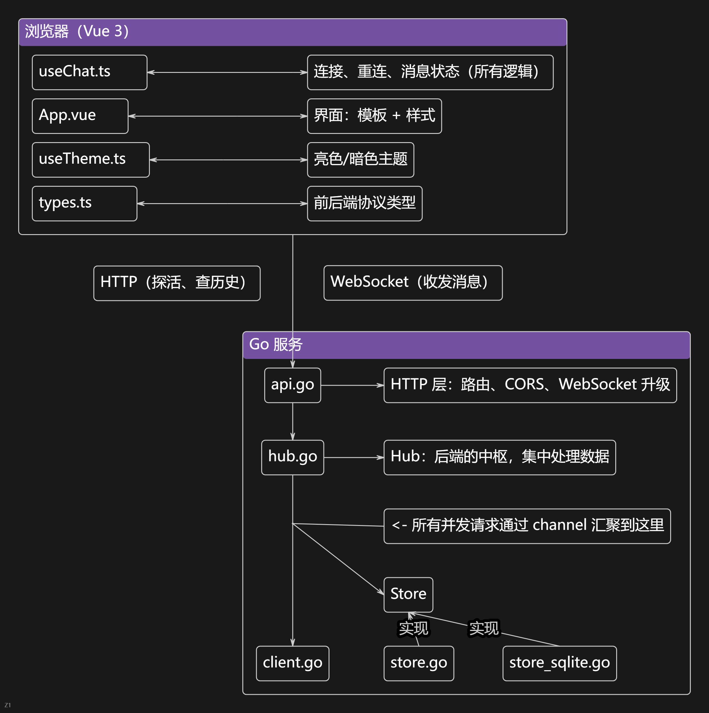
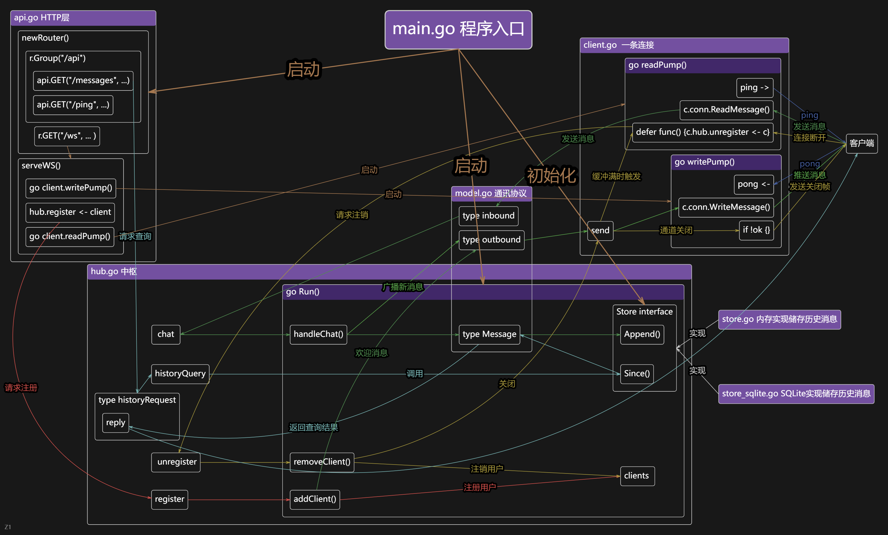

<h1>项目设计说明</h1>

- **本项目的侧重点：** 后端

## 一、整体架构

**后端详细架构：**

## 二、技术栈选择

### 前端：Vue框架

主流框架，文档全、资料多、好上手。

### 后端：Gin

Go原生支持并发，goroutine和channel很好理解，也是很多大项目所使用的语言；而Gin轻量，也没有Go原生的net/http库那么原始，更适合这样的小项目，学习负担也不大。

### 数据库：SQLite

有纯Go写的库，不需要装其它的环境，部署方便。且因为该项目的架构会把所有并发请求串行化，对上了SQLite弱并发的短板，不需要升级为MySQL。

### 传输：WebSocket + HTTP

发消息走 WebSocket，因为聊天是"推送式"的——需要服务端主动把别人的消息
送到你屏幕上，而 HTTP 只能一问一答。

探活和历史查询仍然走 HTTP：它们本来就是"问一次答一次"的场景，
用普通接口更简单、也更容易用 curl 调试。

---

## 三、踩到的坑

1. Windows默认文件路径用反斜杠隔开，但大部分用斜杠，注意转换。

2. 锁的持有范围要尽可能小，绝不能跨越可能阻塞的操作。

3. `map` 是指针类型，复制解引用之后指向地址还是一样。

4. 不要通过共享内存来通讯，而要通过通讯来共享内存。

### 关于"加锁 → 用 channel"的演进

写第二条时，用互斥锁保护共享 map，经常竞态和死锁，因为锁的范围要同时兼顾"不能太大以免阻塞"和"不能太小以免失去保护"，很难两全。

这时我就在想更安全、更简单的架构，也想到了通过通道来传信息，只是实现还不优雅，直到看到那句谚语，问了大肥鱼，瞬间豁然开朗。

写第四条时，遵循 Go 的谚语，改成用 channel 把并发访问串行化，从源头消除了共享状态。

### 更多内容
更多内容可以翻阅源代码注释

---

## 四、开发记录

| 时间 | 记录 |
| --- | ---|
| **10/01 23:22** | 坐了一天车，在车上想好了Vue+Go的路线，终于打开电脑，装好Go环境，打下这行字，对于整个项目还是很迷茫，于是躺在床上继续看Go教程。|
| **10/02 15:40** | 火速学完前端三件套，继续看Go。|
| **10/02 16:22** | 学到Go的接口，感叹于其灵活性，给我只学过cpp的大脑带来了莫大的震撼。|
| **10/02 21:41** | 学完Go基础语法，翻Go后端开发教程发现[这个视频](https://b23/tv/ezAughK)里最后的项目案例就是即时通信系统，直接开始严肃学习。|
| **10/03 20:53** | 边旅游边跟大肥鱼大战300回合终于改出安全的基础后端，由于视频里的技术栈与我选择的不同，所以跟到这就开始迁移。 |
| **10/05 00:21** | 坐了一天车，实在没时间了，让大肥鱼把后端写好，自己看注释慢慢学。 |
| **10/05 16:06** | 学得差不多了，让大肥鱼加上SQLite。 |
| **10/05 16:14** | 学习开源项目在 commit 时用约定式提交规范。|
| **10/06 01:12** | 自己画了个后端架构图。 |
| **10/06 13:11** | VibeCoding 出了前端，只是大肥鱼有点傻，我测试了好几轮每次都能发现新问题。 |
| **10/06 14:41** | 前端代码怎么这么多😨只看注释都看半天，我自己真的能写出来吗。 |
| **10/06 15:08** | 写文档ing。 |
